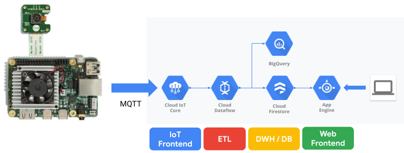

# Cloud Monitor
This repository contains a fundamental demo architecture to aggregate inference data from Coral Dev Board, through ETL pipeline and stores the data in DWH and monitor the data on WebUI in realtime. This architecture is designed for enterprise scale, may be used in production with a few modification.

## Architecture

This demo contains 2 parts, an edge side and a Cloud side.
The edge side (which here means Coral Dev Board) runs a simple
 MobileNet SSD Object Detection. Also the board is registered in
[Cloud IoT Core](https://cloud.google.com/iot-core/), a full-managed
IoT data ingestion & manage service. Once the board detects objects,
the detected data is sent to the Cloud side through IoT Core.
IoT Core pass the data to [Cloud Pub/Sub](https://cloud.google.com/pubsub/),
a full-managed messaging service. The data goes to [BigQuery](https://cloud.google.com/bigquery) for analysis,
and [Cloud Firestore](https://cloud.google.com/firestore/) for realtime monitoring,
as [Cloud Dataflow](https://cloud.google.com/dataflow/) can handle all the data transition.
Finally, you want to see the data on the Cloud! [Google App Engine](https://cloud.google.com/appengine/) hosts a web app, which shows the data from Firestore in realtime.

## Prerequisites

### Hardware:
- [Coral Dev Board](https://coral.withgoogle.com/products/dev-board)
- [Coral Camera Module](https://coral.withgoogle.com/products/camera), or USB Webcam

### Cloud:
You need to make an account and a project on [Google Cloud Platform](https://cloud.google.com/).

#### Enable billing to the project
This demo consumes some non-free resources on GCP. To enable billing to your project, follow the [instruction](https://cloud.google.com/billing/docs/how-to/modify-project#enable_billing_for_a_project).

## Set up
This demo includes 3 parts;
- Inference at the edge,
- ETL pipeline using Dataflow, and
- Realtime WebUI monitor on GAE.  

To set up each parts, go to
1. `/edge`,
2. `/dataflow`,
3. `/webui`

in this repository respectively.

## How to use
Open the webUI on your browser (Refer to `/webui`), and start script (Refer to `/edge`).

## Clean up
To avoid unneccesary consumption, you should clean up resources once you finish the demo.
Follow clean up section for each `/edge`, `/dataflow`, and `/webui`.

Or simply you can delete your project.
Go to [Project setting](https://console.cloud.google.com/iam-admin/settings/project) page, and click **SHUT DOWN** button.
